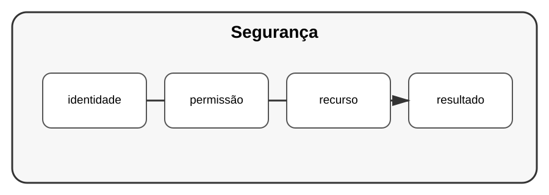

# Aula 4 — Autenticação e autorização

**Assinatura:** Domingos Ferraz Fonseca

## 1. Identidade e permissões

Autenticação responde: "Quem é esta pessoa?"

Autorização responde: "O que esta pessoa pode fazer?"

## 2. Conceito

Um sistema pode ter:

~~~text
utilizador → autenticação → sessão/credencial → recurso
~~~

Nunca devemos guardar palavras-passe em texto simples.

Para aplicações reais, use mecanismos e bibliotecas de segurança adequados em vez de inventar um sistema criptográfico.

## Exercício guiado

Desenhe o fluxo de login de uma aplicação.

## Exercícios

1. Explique autenticação.
2. Explique autorização.
3. Diferencie utilizador comum e administrador.
4. Identifique recursos que precisam de proteção.

## Desafio

Adicione papéis de utilizador a um projeto de estudo.

## Boas práticas

- Nunca guarde palavras-passe em texto simples.
- Não coloque segredos no código.
- Valide permissões no servidor.
- Use bibliotecas maduras.

## Revisão

Segurança começa por separar identidade, permissões e proteção dos dados.
