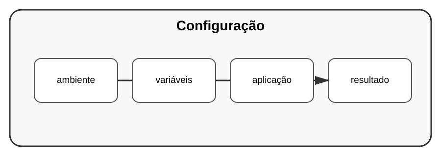

# Aula 5 — Configuração e segredos

**Assinatura:** Domingos Ferraz Fonseca

## 1. Código e configuração

O endereço de um serviço, uma chave de API ou uma configuração de ambiente não devem ficar espalhados pelo código.

Uma abordagem comum é usar variáveis de ambiente.

~~~python
import os

nome = os.getenv("NOME_APLICACAO", "Minha App")
print(nome)
~~~

## 2. Segredos

Chaves privadas e credenciais devem ser tratadas como segredos.

Não devemos colocar algo como isto num repositório público:

~~~python
API_KEY = "minha-chave-real"
~~~

## 3. Arquivo .env

Em desenvolvimento, algumas bibliotecas permitem carregar configurações de um arquivo `.env`. Esse arquivo normalmente não deve ser enviado para o Git quando contém segredos.

## Exercício guiado

Crie uma configuração que tenha um nome de aplicação e uma porta.

## Exercícios

1. Leia uma variável de ambiente.
2. Defina um valor padrão.
3. Explique por que segredos não devem estar no código.
4. Crie um exemplo de configuração para desenvolvimento.

## Desafio

Prepare um projeto para usar configurações diferentes em desenvolvimento e produção.

## Boas práticas

- Nunca publique credenciais.
- Use `.gitignore` para arquivos locais sensíveis.
- Prefira configuração por ambiente.
- Se uma credencial for exposta, substitua-a.

## Revisão

Separar configuração do código melhora segurança, portabilidade e manutenção.
