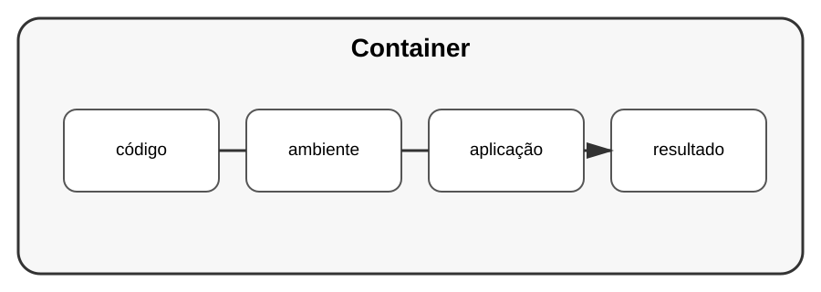

# Aula 6 — Conceito de containers

**Assinatura:** Domingos Ferraz Fonseca

## 1. O problema

"Na minha máquina funciona."

Uma aplicação pode funcionar num computador e falhar em outro por causa de versões, bibliotecas ou configurações.

Containers ajudam a empacotar uma aplicação com o ambiente necessário para executá-la de maneira mais previsível.

## 2. Dockerfile

Um exemplo muito simples:

~~~dockerfile
FROM python:3

WORKDIR /app

COPY requirements.txt .
RUN pip install -r requirements.txt

COPY . .

CMD ["python", "app.py"]
~~~

O exemplo é apenas introdutório. Imagens reais devem ser escolhidas e configuradas de acordo com as necessidades do projeto.

## Exercício guiado

Identifique:

- qual é o ambiente;
- quais dependências existem;
- qual comando inicia a aplicação.

## Exercícios

1. Explique o problema que containers ajudam a resolver.
2. Identifique as partes de um Dockerfile.
3. Explique `WORKDIR`.
4. Explique `CMD`.

## Desafio

Containerize uma aplicação Python pequena e documente como executá-la.

## Boas práticas

- Use imagens apropriadas.
- Evite colocar segredos na imagem.
- Mantenha imagens pequenas quando possível.
- Documente como construir e executar.

## Revisão

Containers ajudam a tornar ambientes de execução mais reproduzíveis, mas não substituem boas práticas de código e segurança.
