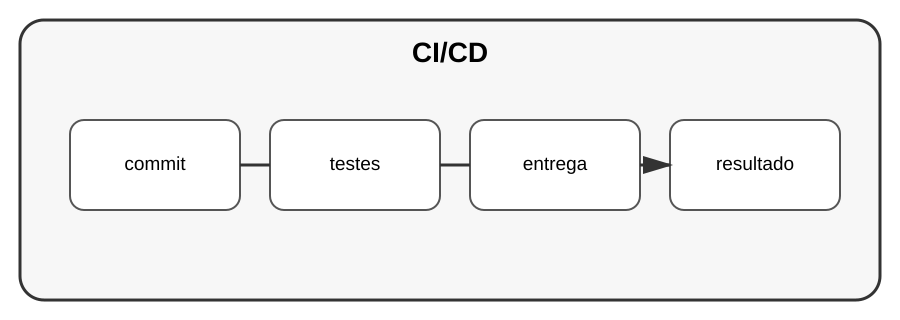

# Aula 7 — CI/CD e automação

**Assinatura:** Domingos Ferraz Fonseca

## 1. O que é CI?

CI significa Continuous Integration.

A ideia é verificar automaticamente o projeto quando alterações são enviadas.

Uma pipeline pode:

1. instalar dependências;
2. verificar qualidade;
3. executar testes;
4. construir artefactos.

## 2. CD

CD pode significar entrega ou implantação contínua, dependendo do contexto.

O objetivo é automatizar a passagem de alterações testadas para ambientes de entrega.

## 3. Exemplo de fluxo

~~~text
código → testes → validação → build → entrega
~~~

## Exercício guiado

Desenhe uma pipeline para o seu projeto.

## Exercícios

1. Liste verificações automáticas.
2. Inclua testes.
3. Pense em uma etapa de build.
4. Defina quando uma alteração pode ser entregue.

## Desafio

Crie uma pipeline no GitHub Actions que instale Python, instale dependências e execute os testes do projeto.

## Boas práticas

- Automatize tarefas repetitivas.
- Faça os testes correrem cedo.
- Não coloque segredos diretamente no ficheiro da pipeline.
- Mantenha a pipeline simples.

## Revisão

CI/CD transforma verificações manuais repetitivas em processos automáticos e reproduzíveis.
