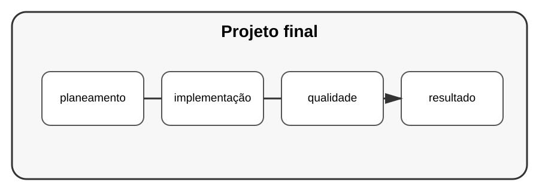

# Aula 8 — Projeto final: aplicação profissional

**Assinatura:** Domingos Ferraz Fonseca

## Projeto

Vamos juntar conhecimentos dos volumes anteriores.

### Sistema de Gestão de Tarefas

O sistema deverá possuir:

- CLI ou API;
- classes ou dataclasses;
- type hints;
- persistência em JSON ou SQLite;
- tratamento de exceções;
- logging;
- testes;
- configuração por ambiente;
- documentação;
- estrutura de projeto organizada.

## Estrutura sugerida

~~~text
gestao_tarefas/
├── app/
│   ├── modelos.py
│   ├── servicos.py
│   ├── repositorio.py
│   └── configuracao.py
├── testes/
├── README.md
├── requirements.txt
└── .gitignore
~~~

## Etapas

### Etapa 1 — Planeamento

Escreva os requisitos.

### Etapa 2 — Modelo

Crie a representação de uma tarefa.

### Etapa 3 — Regras

Implemente criar, listar, concluir e remover.

### Etapa 4 — Persistência

Guarde os dados.

### Etapa 5 — Interface

Escolha CLI ou API.

### Etapa 6 — Qualidade

Adicione testes, logging e tratamento de erros.

### Etapa 7 — Documentação

Explique instalação, configuração e utilização.

### Etapa 8 — Entrega

Prepare o projeto para ser executado por outra pessoa.

## Desafio final

Uma pessoa que nunca viu o seu código deve conseguir:

1. instalar o projeto;
2. configurá-lo;
3. executá-lo;
4. entender como funciona;
5. executar os testes.

## Checklist

- [ ] requisitos definidos
- [ ] projeto organizado
- [ ] código tipado
- [ ] testes
- [ ] tratamento de erros
- [ ] logging
- [ ] configuração
- [ ] README
- [ ] dependências
- [ ] Git organizado

## Revisão do Volume 11

Projetos profissionais não são apenas código. Eles envolvem planeamento, organização, segurança, testes, configuração, documentação, automação e capacidade de manutenção.

Este volume transforma conhecimentos isolados em uma visão de desenvolvimento de software completo.
