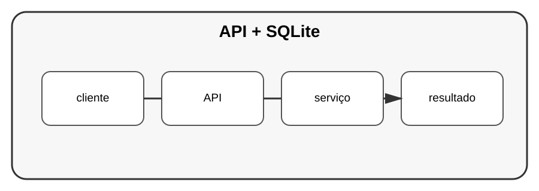

# Aula 1 — Projeto: API com SQLite

**Assinatura:** Domingos Ferraz Fonseca

## Objetivo

Vamos juntar API, SQLite, CRUD, validação, organização e testes num único projeto.

## Arquitetura

~~~text
cliente
   ↓
API
   ↓
serviço
   ↓
repositório
   ↓
SQLite
~~~

## Modelo

Uma tarefa pode ter:

~~~python
from dataclasses import dataclass

@dataclass
class Tarefa:
    id: int | None
    titulo: str
    concluida: bool = False
~~~

## Repositório

O repositório deve concentrar o acesso ao banco.

~~~python
import sqlite3

class TarefaRepositorio:
    def __init__(self, caminho: str):
        self.caminho = caminho

    def listar(self):
        with sqlite3.connect(self.caminho) as conexao:
            return conexao.execute(
                "SELECT id, titulo, concluida FROM tarefas"
            ).fetchall()
~~~

## Exercício guiado

Desenhe as três camadas antes de implementar:

1. API;
2. serviço;
3. repositório.

## Exercícios

1. Crie a tabela.
2. Implemente inserir.
3. Implemente listar.
4. Implemente remover.

## Desafio

Complete o CRUD e crie testes para o repositório.

## Boas práticas

Separe regras de negócio do acesso ao banco e nunca monte SQL usando concatenação insegura de dados recebidos pelo utilizador.

## Revisão

Uma aplicação profissional cresce melhor quando cada camada possui uma responsabilidade clara.
