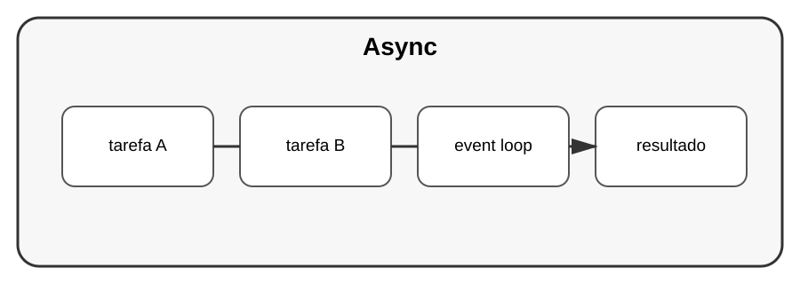

# Aula 2 — APIs assíncronas

**Assinatura:** Domingos Ferraz Fonseca

## 1. O que significa async?

Programação assíncrona permite que uma aplicação organize operações que envolvem espera sem bloquear desnecessariamente o fluxo.

## 2. Sintaxe básica

~~~python
import asyncio

async def tarefa():
    await asyncio.sleep(1)
    return "terminou"

resultado = asyncio.run(tarefa())
print(resultado)
~~~

`async def` cria uma função assíncrona e `await` espera uma operação assíncrona.

## 3. Várias tarefas

~~~python
async def principal():
    resultados = await asyncio.gather(
        tarefa(),
        tarefa()
    )
    print(resultados)
~~~

Isso é útil quando as operações são apropriadas para execução concorrente assíncrona.

## Exercício guiado

Crie duas funções assíncronas simples e execute-as com `asyncio.gather()`.

## Exercícios

1. Crie uma função `async`.
2. Use `await`.
3. Use `asyncio.run()`.
4. Experimente `gather()`.

## Desafio

Modele uma aplicação que precise esperar várias operações de entrada/saída.

## Boas práticas

- Não transforme tudo em async sem necessidade.
- Saiba se a biblioteca usada suporta operações assíncronas.
- Separe código síncrono de código assíncrono com clareza.

## Revisão

Async é especialmente importante quando um programa precisa lidar com muitas operações de espera de forma eficiente.
