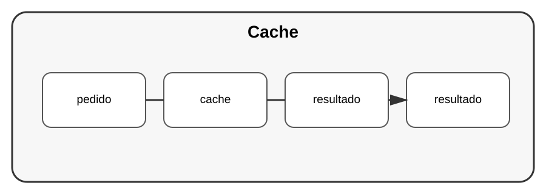

# Aula 3 — Cache

**Assinatura:** Domingos Ferraz Fonseca

## 1. O que é cache?

Cache guarda temporariamente um resultado para evitar repetir trabalho.

Imagine uma função cara:

~~~python
def calcular(numero):
    print("calculando...")
    return numero * numero
~~~

Podemos usar `functools.lru_cache`:

~~~python
from functools import lru_cache

@lru_cache
def calcular(numero):
    print("calculando...")
    return numero * numero
~~~

Chamadas repetidas podem aproveitar resultados armazenados.

## 2. O custo do cache

Cache usa memória e pode ficar desatualizado.

Por isso precisamos pensar:

- o que guardar?
- durante quanto tempo?
- quando invalidar?

## Exercício guiado

Crie uma função repetitiva e experimente `@lru_cache`.

## Exercícios

1. Explique cache.
2. Use `lru_cache`.
3. Identifique uma operação que poderia ser cacheada.
4. Explique por que dados desatualizados são um problema.

## Desafio

Compare uma função com e sem cache usando medições.

## Boas práticas

Cache deve resolver um problema real de desempenho. Não o adicione apenas porque parece avançado.

## Revisão

Cache troca espaço e complexidade por possíveis ganhos de desempenho.
