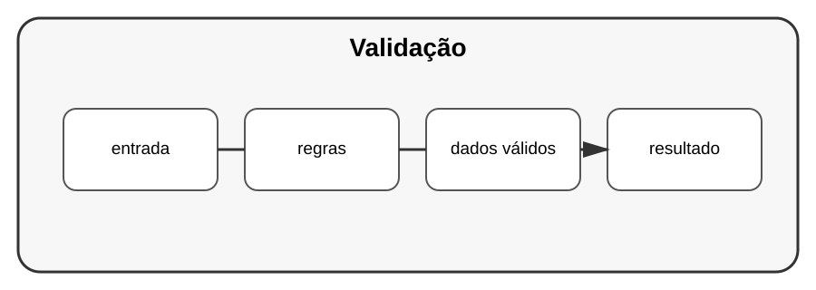

# Aula 4 — Validação de dados

**Assinatura:** Domingos Ferraz Fonseca

## 1. Entrada confiável

Dados vindos de utilizadores, arquivos ou APIs devem ser tratados como dados que precisam de validação.

Exemplo:

~~~python
def validar_idade(idade: int) -> int:
    if idade < 0 or idade > 130:
        raise ValueError("Idade inválida")
    return idade
~~~

## 2. Validação em camadas

Podemos validar:

- tipo;
- formato;
- intervalo;
- regras de negócio.

## 3. Não confundir validação com autorização

Uma idade válida não significa que a pessoa tenha autorização para executar determinada operação.

São conceitos diferentes.

## Exercício guiado

Crie funções de validação para nome, idade e preço.

## Exercícios

1. Valide um número positivo.
2. Valide uma string não vazia.
3. Valide um preço.
4. Crie testes para entradas inválidas.

## Desafio

Crie uma camada de validação para os dados de uma API.

## Boas práticas

Valide dados próximos da entrada e mantenha as regras importantes centralizadas.

## Revisão

Validação protege a aplicação contra dados incorretos e torna os erros mais previsíveis.
