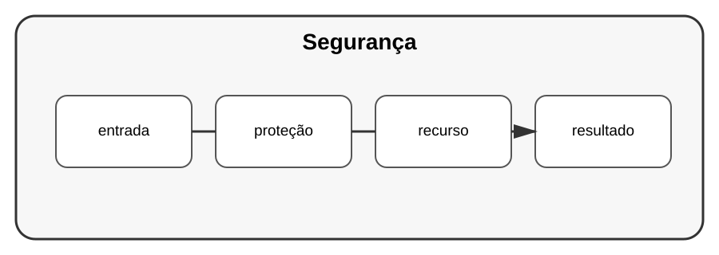

# Aula 5 — Segurança de aplicações web

**Assinatura:** Domingos Ferraz Fonseca

## 1. Segurança é parte do projeto

Segurança não deve ser adicionada apenas no final.

Pense em:

- autenticação;
- autorização;
- validação;
- gestão de segredos;
- controlo de acesso;
- proteção dos dados;
- atualização das dependências.

## 2. SQL Injection

Nunca construa consultas assim:

~~~python
sql = "SELECT * FROM utilizadores WHERE nome = '" + nome + "'"
~~~

Use parâmetros:

~~~python
cursor.execute(
    "SELECT * FROM utilizadores WHERE nome = ?",
    (nome,)
)
~~~

## 3. Segredos

Chaves e credenciais não devem ser colocadas diretamente no código ou publicadas no repositório.

## Exercício guiado

Procure num projeto de estudo:

- entradas externas;
- consultas ao banco;
- configurações;
- permissões.

## Exercícios

1. Explique SQL injection.
2. Mostre uma consulta parametrizada.
3. Identifique um segredo que não deveria estar no código.
4. Explique autenticação versus autorização.

## Desafio

Faça uma revisão de segurança de um projeto seu usando uma checklist.

## Boas práticas

Use bibliotecas maduras, atualize dependências e trate dados externos com desconfiança apropriada.

## Revisão

Segurança é uma preocupação transversal: código, dados, dependências, configuração e infraestrutura fazem parte dela.
