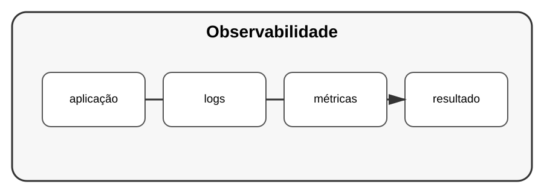

# Aula 6 — Observabilidade

**Assinatura:** Domingos Ferraz Fonseca

## 1. Ver o que acontece

Uma aplicação em produção precisa fornecer informações suficientes para perceber o que está acontecendo.

Três ideias importantes:

- logs;
- métricas;
- traces.

## 2. Logs

Já aprendemos a usar `logging`.

Um log pode indicar:

~~~text
INFO pedido recebido
INFO processamento iniciado
ERROR processamento falhou
~~~

## 3. Métricas

Uma métrica pode contar:

- número de pedidos;
- tempo de resposta;
- erros;
- utilização de recursos.

## 4. Traces

Tracing ajuda a acompanhar uma operação através de várias partes de um sistema.

## Exercício guiado

Escolha uma aplicação e escreva cinco acontecimentos que seria útil observar.

## Exercícios

1. Crie logs para uma operação.
2. Defina duas métricas.
3. Descreva um fluxo que precisaria de tracing.
4. Explique por que observabilidade ajuda na manutenção.

## Desafio

Adicione logs estruturados e métricas simples a um projeto.

## Boas práticas

Não registre dados sensíveis sem necessidade. Logs devem ajudar, não criar um novo problema de segurança.

## Revisão

Observabilidade transforma o comportamento interno de uma aplicação em informação útil para manutenção e diagnóstico.
