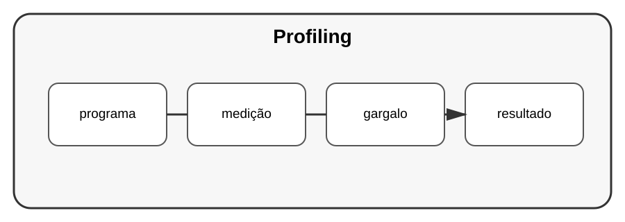

# Aula 7 — Profiling e memória

**Assinatura:** Domingos Ferraz Fonseca

## 1. Medir CPU e memória

Já aprendemos a medir tempo. Em projetos maiores, podemos investigar onde o programa gasta recursos.

Python oferece ferramentas como `cProfile` para analisar execução.

~~~bash
python -m cProfile programa.py
~~~

## 2. Profiling não é adivinhação

O objetivo é encontrar partes realmente relevantes.

Uma função lenta pode ser apenas um sintoma de uma decisão anterior.

## 3. Memória

Estruturas grandes podem consumir muita memória. Geradores podem ser úteis quando queremos produzir valores sob demanda.

~~~python
def numeros(n):
    for i in range(n):
        yield i
~~~

## Exercício guiado

Escolha um programa pequeno e faça um perfil simples.

## Exercícios

1. Execute `cProfile`.
2. Identifique a função mais relevante.
3. Pense numa alteração.
4. Meça novamente.

## Desafio

Compare duas soluções para um problema e investigue tempo e memória.

## Boas práticas

Meça antes e depois. Guarde as medições e explique por que uma alteração foi feita.

## Revisão

Profiling ajuda a encontrar gargalos reais e evita otimizações baseadas apenas em suposições.
