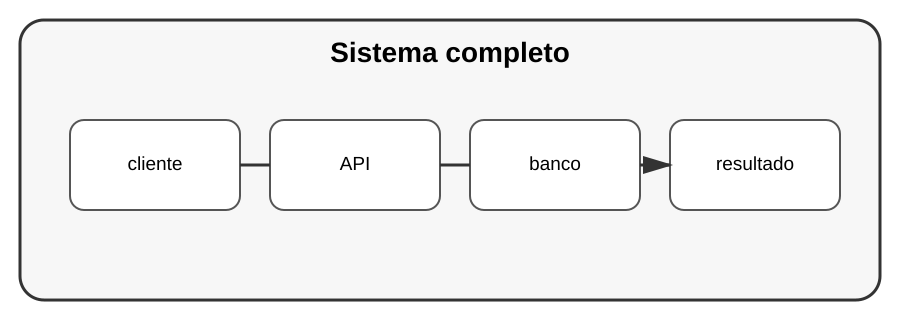

# Aula 8 — Projeto avançado: sistema completo

**Assinatura:** Domingos Ferraz Fonseca

## Objetivo

Construir uma aplicação Python completa reunindo arquitetura, banco de dados, API, segurança, testes, observabilidade e automação.

## Projeto: Plataforma de Tarefas

### Funcionalidades

- cadastro de utilizadores;
- autenticação;
- criação de tarefas;
- edição;
- conclusão;
- pesquisa;
- persistência;
- API;
- logs;
- testes.

## Arquitetura sugerida

~~~text
cliente
   ↓
API
   ↓
serviços
   ↓
repositórios
   ↓
SQLite
~~~

Componentes transversais:

~~~text
configuração
segurança
logging
testes
CI/CD
~~~

## Fases

### Fase 1
Definir requisitos.

### Fase 2
Criar modelos e banco.

### Fase 3
Criar serviços.

### Fase 4
Criar API.

### Fase 5
Adicionar autenticação e autorização.

### Fase 6
Adicionar testes.

### Fase 7
Adicionar logging e observabilidade.

### Fase 8
Preparar execução e documentação.

## Desafio final

O projeto deverá ser suficientemente organizado para que outra pessoa consiga clonar, configurar, testar e executar a aplicação sem depender de explicações pessoais.

## Checklist

- [ ] arquitetura definida
- [ ] banco funcionando
- [ ] API funcionando
- [ ] validação
- [ ] autenticação
- [ ] autorização
- [ ] testes
- [ ] logs
- [ ] configuração
- [ ] documentação
- [ ] CI/CD

## Revisão do Volume 12

Este volume aproximou-nos de problemas encontrados em sistemas reais: concorrência assíncrona, cache, validação, segurança, observabilidade e profiling.

O objetivo agora é saber escolher ferramentas de acordo com o problema, e não simplesmente acumular funcionalidades.
