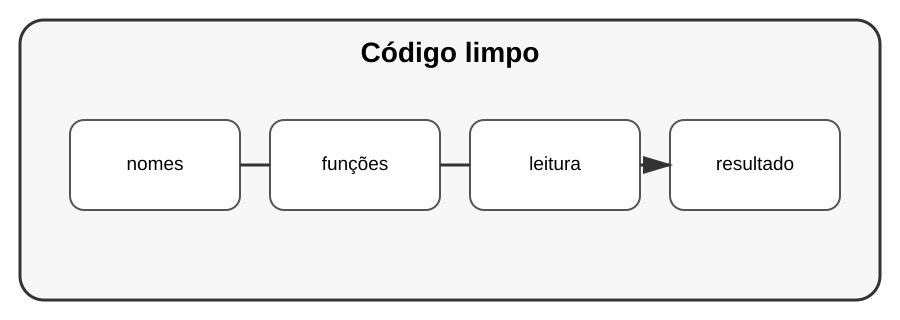

# Aula 1 — Código limpo e legível

**Assinatura:** Domingos Ferraz Fonseca

## Objetivo

Código profissional precisa ser compreendido por pessoas, não apenas executado por computadores.

## 1. Nomes claros

Prefira:

~~~python
quantidade_de_alunos = 30
~~~

em vez de:

~~~python
q = 30
~~~

Um bom nome reduz a necessidade de comentários.

## 2. Funções pequenas

Uma função deve ter uma responsabilidade clara.

~~~python
def calcular_total(preco: float, quantidade: int) -> float:
    return preco * quantidade
~~~

## 3. Comentários

Comentários podem explicar decisões difíceis. Não devem apenas repetir o código.

## Exercício guiado

Pegue um código antigo seu e melhore nomes, funções e organização.

## Exercícios

1. Renomeie variáveis pouco claras.
2. Divida uma função grande.
3. Remova comentários desnecessários.
4. Escreva um comentário explicando uma decisão realmente importante.

## Desafio

Faça uma revisão de legibilidade de um pequeno projeto.

## Boas práticas

- nomes claros;
- funções focadas;
- código consistente;
- pouca duplicação;
- comentários para contexto.

## Revisão

Código limpo facilita leitura, testes, manutenção e colaboração.
