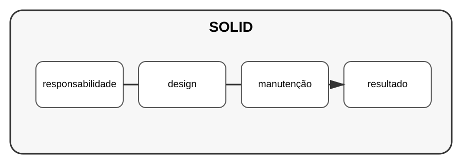

# Aula 2 — Princípios SOLID

**Assinatura:** Domingos Ferraz Fonseca

## 1. O que é SOLID?

SOLID é um conjunto de princípios usados para pensar sobre design de software orientado a objetos.

Os cinco princípios são:

- Single Responsibility;
- Open/Closed;
- Liskov Substitution;
- Interface Segregation;
- Dependency Inversion.

## 2. Responsabilidade única

Uma classe deve ter uma responsabilidade bem definida.

Em vez de uma classe fazer cadastro, enviar email e gerar relatórios, podemos separar essas responsabilidades.

## 3. Por que isso ajuda?

Classes menores e bem separadas tendem a ser mais fáceis de testar e modificar.

## Exercício guiado

Pegue uma classe que faça várias coisas e liste suas responsabilidades.

## Exercícios

1. Explique cada letra de SOLID.
2. Identifique uma classe com responsabilidades demais.
3. Separe duas responsabilidades.
4. Escreva um teste para uma das partes.

## Desafio

Refatore um pequeno sistema aplicando pelo menos dois princípios SOLID.

## Boas práticas

SOLID é uma ferramenta de raciocínio, não uma coleção de regras que precisam ser aplicadas mecanicamente.

## Revisão

SOLID ajuda a criar software mais flexível, testável e organizado quando usado com bom senso.
