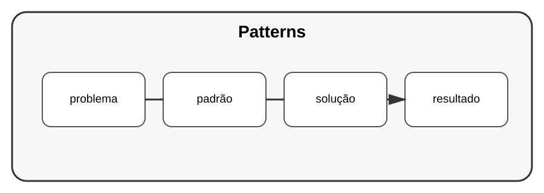

# Aula 3 — Padrões de projeto

**Assinatura:** Domingos Ferraz Fonseca

## 1. O que é um padrão?

Um padrão de projeto descreve uma solução recorrente para um problema de design.

Alguns exemplos:

- Factory;
- Strategy;
- Adapter;
- Observer.

## 2. Strategy

Imagine diferentes formas de calcular um desconto.

~~~python
def desconto_normal(preco: float) -> float:
    return preco

def desconto_especial(preco: float) -> float:
    return preco * 0.9
~~~

Uma estratégia permite trocar o comportamento usado sem alterar toda a aplicação.

## 3. Adapter

Um Adapter pode adaptar uma interface para outra.

Isso é útil quando precisamos integrar componentes com formatos diferentes.

## Exercício guiado

Identifique dois comportamentos que poderiam ser escolhidos pelo programa.

## Exercícios

1. Explique o objetivo de um padrão.
2. Pesquise o problema resolvido por Factory.
3. Crie duas estratégias.
4. Desenhe um Adapter simples.

## Desafio

Use Strategy num sistema de cálculo de preços.

## Boas práticas

Não introduza padrões só para deixar o código mais sofisticado.

## Revisão

Padrões são vocabulário de engenharia. O mais importante é compreender o problema antes de escolher a solução.
