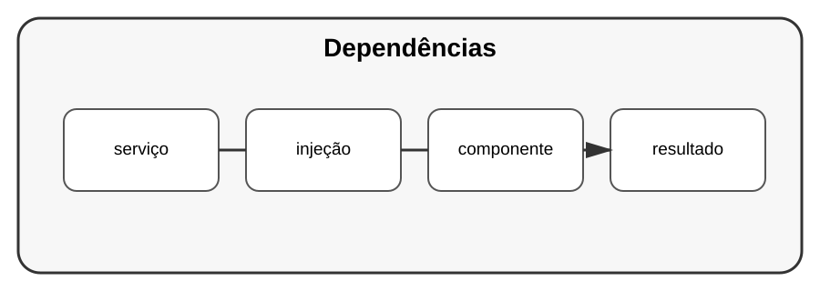

# Aula 4 — Injeção de dependências

**Assinatura:** Domingos Ferraz Fonseca

## 1. Dependência

Uma classe depende de outra quando precisa dela para realizar seu trabalho.

Podemos passar a dependência pelo construtor:

~~~python
class ServicoTarefas:
    def __init__(self, repositorio):
        self.repositorio = repositorio
~~~

Agora o serviço não precisa criar diretamente o repositório.

## 2. Por que isso ajuda?

Durante testes, podemos fornecer uma implementação simples ou simulada.

~~~python
repositorio_de_teste = RepositorioEmMemoria()
servico = ServicoTarefas(repositorio_de_teste)
~~~

## Exercício guiado

Crie um serviço que receba seu repositório por parâmetro.

## Exercícios

1. Identifique dependências num projeto.
2. Passe uma dependência pelo construtor.
3. Crie uma implementação em memória.
4. Teste o serviço usando essa implementação.

## Desafio

Refatore um projeto para que os serviços não criem diretamente suas dependências principais.

## Boas práticas

Injeção de dependências deve reduzir acoplamento, não criar uma arquitetura desnecessariamente complicada.

## Revisão

Quando dependências podem ser fornecidas de fora, testar e trocar componentes torna-se mais fácil.
