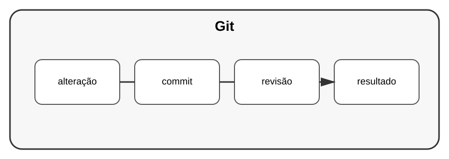

# Aula 6 — Git profissional

**Assinatura:** Domingos Ferraz Fonseca

## 1. Git

Git registra a evolução do código.

Um fluxo simples:

~~~text
alterar → testar → commit → revisão → merge
~~~

## 2. Commits

Um commit deve representar uma alteração compreensível.

Exemplo:

~~~text
Adiciona validação de tarefas
~~~

Evite mensagens vagas como:

~~~text
coisas
~~~

## 3. Branches

Branches permitem desenvolver funcionalidades separadamente.

## 4. Pull requests

Uma pull request permite revisar alterações antes de integrá-las.

## Exercício guiado

Crie uma branch para uma pequena funcionalidade, faça uma alteração e registre-a num commit.

## Exercícios

1. Crie uma branch.
2. Faça uma alteração pequena.
3. Escreva uma mensagem clara.
4. Revise o diff antes de integrar.

## Desafio

Simule um fluxo de revisão de código com uma funcionalidade pequena.

## Boas práticas

- commits pequenos e claros;
- branches com objetivo;
- revisão antes do merge;
- nunca colocar segredos no Git.

## Revisão

Git profissional não é apenas guardar código: é organizar a evolução e facilitar colaboração.
