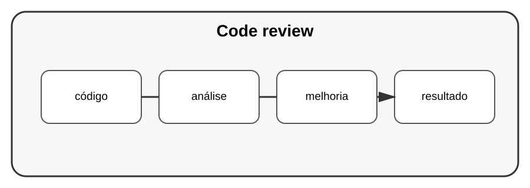

# Aula 7 — Revisão de código

**Assinatura:** Domingos Ferraz Fonseca

## 1. O que é code review?

É a análise de uma alteração por outra pessoa ou pelo próprio autor antes da integração.

Perguntas úteis:

- O código está correto?
- É fácil de entender?
- Há testes?
- Existem riscos de segurança?
- A alteração é maior do que precisava?

## 2. Como dar feedback

Prefira comentários sobre o código e o problema, não sobre a pessoa.

Em vez de:

~~~text
Você fez isso errado.
~~~

Podemos explicar:

~~~text
Esta condição também precisa tratar o caso em que a lista está vazia.
~~~

## Exercício guiado

Pegue uma alteração pequena e faça uma revisão usando uma checklist.

## Exercícios

1. Verifique testes.
2. Verifique nomes.
3. Verifique tratamento de erros.
4. Verifique segurança.

## Desafio

Crie uma checklist própria para revisão de Python.

## Boas práticas

Code review deve procurar riscos e oportunidades de melhoria, não servir para humilhar quem escreveu o código.

## Revisão

Uma boa revisão aumenta a qualidade do software e também ajuda a equipa a compartilhar conhecimento.
