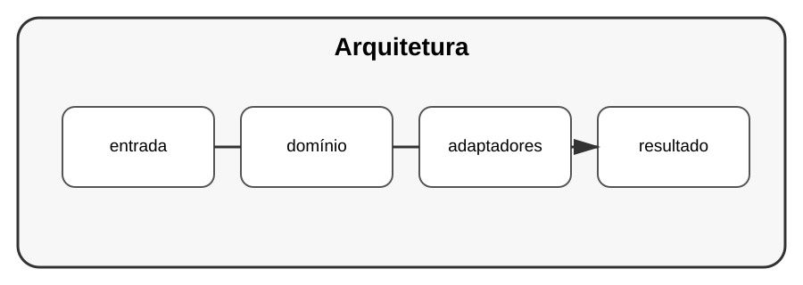

# Aula 8 — Arquitetura avançada

**Assinatura:** Domingos Ferraz Fonseca

## 1. Separar o núcleo

Em sistemas maiores, podemos separar regras de negócio de detalhes externos.

Uma visão simplificada:

~~~text
          API
           ↓
      aplicação
           ↓
     domínio/regras
           ↓
   portas e interfaces
       ↙       ↘
   banco      serviços
~~~

A ideia é que o núcleo do sistema não dependa diretamente de detalhes externos.

## 2. Portas e adaptadores

Uma interface pode definir o que o domínio precisa.

Um adaptador implementa essa interface para um banco, API ou outro mecanismo.

## 3. Quando usar?

Arquiteturas avançadas podem ser úteis em sistemas grandes ou com requisitos de mudança importantes.

Para projetos pequenos, uma estrutura mais simples pode ser melhor.

## Exercício guiado

Pegue o projeto de tarefas e identifique:

- domínio;
- entrada;
- saída;
- dependências externas.

## Exercícios

1. Desenhe a arquitetura.
2. Identifique uma porta.
3. Identifique um adaptador.
4. Explique o que deve permanecer independente.

## Desafio final

Refatore o projeto de tarefas para separar regras de negócio dos detalhes de persistência e interface.

## Boas práticas

Arquitetura é uma ferramenta para controlar complexidade. Não transforme um programa pequeno numa estrutura gigante sem necessidade.

## Revisão do Volume 13

Neste volume estudámos práticas de engenharia:

- código limpo;
- SOLID;
- padrões de projeto;
- injeção de dependências;
- testes de integração;
- Git;
- code review;
- arquitetura avançada.

O objetivo é aprender a tomar decisões de design, e não decorar regras.
