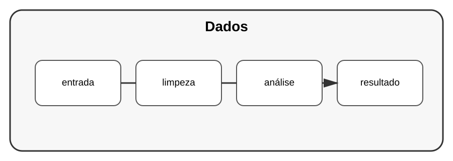

# Aula 1 — Python para dados

**Assinatura:** Domingos Ferraz Fonseca

## Objetivo

Python é muito usado para trabalhar com dados: ler, organizar, transformar, analisar e apresentar informação.

## 1. O fluxo

Um projeto de dados costuma seguir uma sequência:

~~~text
dados → limpeza → transformação → análise → resultado
~~~

## 2. Listas e dicionários

Antes de bibliotecas especializadas, precisamos dominar as estruturas do próprio Python.

~~~python
alunos = [
    {"nome": "Ana", "nota": 15},
    {"nome": "João", "nota": 12},
]
~~~

Podemos percorrer os dados:

~~~python
for aluno in alunos:
    print(aluno["nome"], aluno["nota"])
~~~

## Exercício guiado

Crie uma lista com cinco produtos e preços. Calcule o total.

## Exercícios

1. Crie uma lista de dicionários.
2. Calcule uma média.
3. Encontre o maior valor.
4. Filtre dados segundo uma condição.

## Desafio

Analise uma pequena lista de vendas e descubra total, média e maior venda.

## Boas práticas

Antes de usar uma biblioteca, compreenda o formato e o significado dos dados.

## Revisão

Trabalhar com dados começa pela representação correta, limpeza e transformação das informações.
