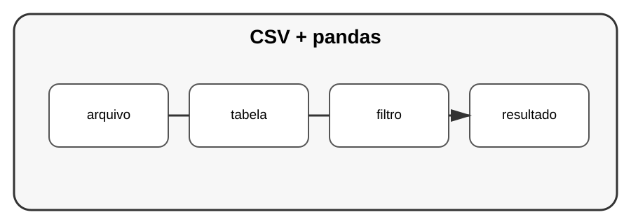

# Aula 2 — CSV e pandas

**Assinatura:** Domingos Ferraz Fonseca

## 1. Tabelas

CSV é um formato simples para representar dados tabulares.

Uma biblioteca muito usada para análise é o pandas.

~~~python
import pandas as pd

dados = pd.read_csv("vendas.csv")

print(dados.head())
~~~

## 2. Selecionando dados

~~~python
print(dados["preco"])
~~~

Podemos filtrar:

~~~python
filtrados = dados[dados["preco"] > 100]
~~~

## 3. Cuidados

Uma tabela real pode conter:

- valores ausentes;
- nomes inconsistentes;
- números armazenados como texto;
- duplicados.

Antes de analisar, precisamos verificar os dados.

## Exercício guiado

Crie um CSV pequeno e carregue-o com pandas.

## Exercícios

1. Mostre as primeiras linhas.
2. Selecione uma coluna.
3. Filtre valores.
4. Verifique valores ausentes.

## Desafio

Analise um arquivo de vendas e produza um resumo.

## Boas práticas

Não confie cegamente nos dados. Inspecione tipos, valores ausentes e formatos.

## Revisão

pandas facilita operações tabulares, mas a qualidade da análise depende da qualidade dos dados.
