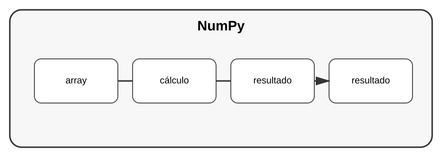

# Aula 3 — NumPy e computação numérica

**Assinatura:** Domingos Ferraz Fonseca

## 1. Arrays

NumPy fornece estruturas eficientes para computação numérica.

~~~python
import numpy as np

valores = np.array([10, 20, 30, 40])

print(valores.mean())
print(valores.sum())
~~~

## 2. Operações vetorizadas

Podemos aplicar operações a vários valores:

~~~python
valores = np.array([1, 2, 3])
resultado = valores * 2

print(resultado)
~~~

## 3. Matrizes

NumPy também trabalha com arrays multidimensionais.

~~~python
matriz = np.array([
    [1, 2],
    [3, 4]
])
~~~

## Exercício guiado

Crie um array de notas e calcule média, mínimo e máximo.

## Exercícios

1. Crie um array.
2. Calcule a soma.
3. Multiplique os valores.
4. Crie uma matriz.

## Desafio

Analise um conjunto de medições usando NumPy.

## Boas práticas

Use NumPy quando o problema realmente envolve computação numérica e arrays.

## Revisão

NumPy fornece estruturas e operações eficientes para cálculo numérico em Python.
