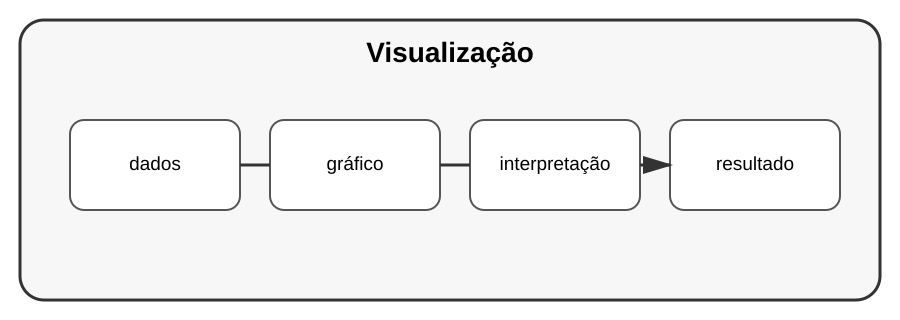

# Aula 4 — Visualização de dados

**Assinatura:** Domingos Ferraz Fonseca

## 1. Por que visualizar?

Um conjunto de números pode ser difícil de compreender. Um gráfico pode revelar tendências rapidamente.

Com matplotlib:

~~~python
import matplotlib.pyplot as plt

meses = ["Jan", "Fev", "Mar"]
vendas = [10, 15, 12]

plt.plot(meses, vendas)
plt.xlabel("Mês")
plt.ylabel("Vendas")
plt.title("Vendas por mês")
plt.show()
~~~

## 2. Escolher o gráfico

- linha: evolução ao longo do tempo;
- barras: comparação;
- dispersão: relação entre valores.

## Exercício guiado

Crie um gráfico de vendas mensais.

## Exercícios

1. Faça um gráfico de linha.
2. Faça um gráfico de barras.
3. Adicione título e rótulos.
4. Escolha um gráfico apropriado para um conjunto de dados.

## Desafio

Crie um pequeno relatório visual de vendas.

## Boas práticas

Um gráfico deve comunicar uma ideia. Evite elementos que dificultem a leitura.

## Revisão

Visualização transforma dados em informação mais fácil de interpretar.
