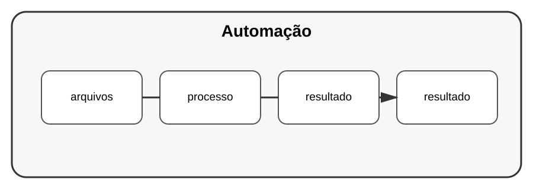

# Aula 5 — Automação de tarefas

**Assinatura:** Domingos Ferraz Fonseca

## 1. Automatizar

Automação significa deixar o computador executar uma tarefa repetitiva.

Podemos trabalhar com arquivos usando `pathlib`:

~~~python
from pathlib import Path

pasta = Path("documentos")

for arquivo in pasta.iterdir():
    print(arquivo.name)
~~~

## 2. Criar pastas

~~~python
Path("relatorios").mkdir(exist_ok=True)
~~~

## 3. Automatizar com cuidado

Antes de executar uma automação sobre muitos arquivos, teste com dados de exemplo.

## Exercício guiado

Crie um programa que liste arquivos de uma pasta.

## Exercícios

1. Liste arquivos.
2. Filtre por extensão.
3. Crie uma pasta.
4. Conte arquivos.

## Desafio

Crie uma ferramenta que organize arquivos de uma pasta por extensão, mas teste primeiro em uma pasta de estudo.

## Boas práticas

- faça cópias antes de operações importantes;
- teste com poucos arquivos;
- registre o que foi alterado;
- evite apagar dados automaticamente.

## Revisão

Automação pode poupar muito tempo, mas deve ser construída com validação e cuidado.
