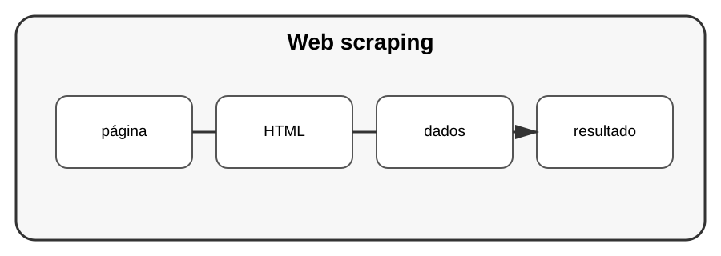

# Aula 6 — Coleta de dados da web

**Assinatura:** Domingos Ferraz Fonseca

## 1. O que é web scraping?

É a extração automatizada de informação de páginas web quando isso é permitido pelo site e apropriado para o uso.

Uma ferramenta comum para analisar HTML é Beautiful Soup.

~~~python
from bs4 import BeautifulSoup

html = "<h1>Olá</h1>"
soup = BeautifulSoup(html, "html.parser")

print(soup.h1.text)
~~~

## 2. Regras importantes

Antes de coletar dados:

- verifique os termos do site;
- respeite limites de acesso;
- não tente contornar mecanismos de proteção;
- colete apenas o necessário.

## Exercício guiado

Analise um pequeno HTML local.

## Exercícios

1. Crie um documento HTML simples.
2. Encontre um título.
3. Encontre uma lista.
4. Extraia textos.

## Desafio

Construa um extrator para uma página de estudo local, sem sobrecarregar nenhum serviço.

## Boas práticas

Prefira APIs oficiais quando existirem. Respeite políticas, robots e limites aplicáveis.

## Revisão

Web scraping é uma técnica de coleta, mas deve ser usada de maneira responsável e conforme as regras do serviço.
