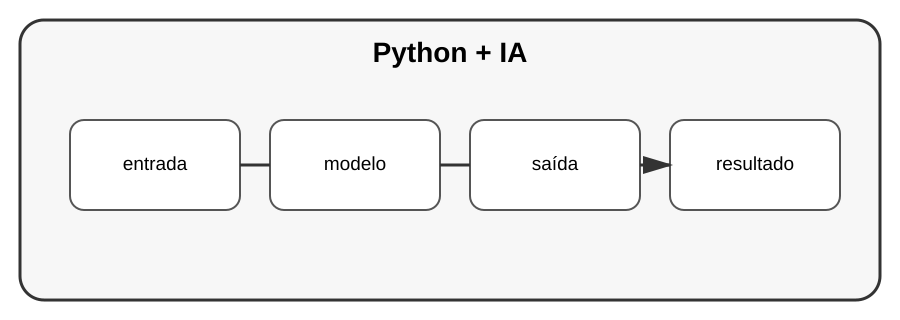

# Aula 7 — Python e Inteligência Artificial

**Assinatura:** Domingos Ferraz Fonseca

## 1. O papel de Python na IA

Python é muito utilizado para trabalhar com modelos, dados e aplicações de inteligência artificial.

Um sistema de IA pode ser visto como:

~~~text
entrada → processamento/modelo → saída
~~~

## 2. Não basta chamar um modelo

Uma aplicação de IA também precisa de:

- validação;
- tratamento de erros;
- segurança;
- controlo de custos;
- testes;
- observabilidade.

## 3. Exemplo conceitual

~~~python
def preparar_pergunta(texto: str) -> str:
    return texto.strip()
~~~

Uma aplicação real adicionaria uma camada responsável pela comunicação com o serviço de IA.

## Exercício guiado

Desenhe uma aplicação que receba uma pergunta e apresente uma resposta de um modelo.

## Exercícios

1. Identifique entrada e saída.
2. Crie uma função de preparação.
3. Pense em erros de rede.
4. Pense em dados que não deveriam ser enviados.

## Desafio

Projete um assistente de estudo com Python, definindo arquitetura, validação, testes e segurança antes da implementação.

## Boas práticas

Não envie dados sensíveis para serviços externos sem autorização e compreensão das políticas aplicáveis.

## Revisão

IA aplicada é engenharia de software + dados + modelos. Uma aplicação responsável precisa de mais do que uma chamada a um modelo.
