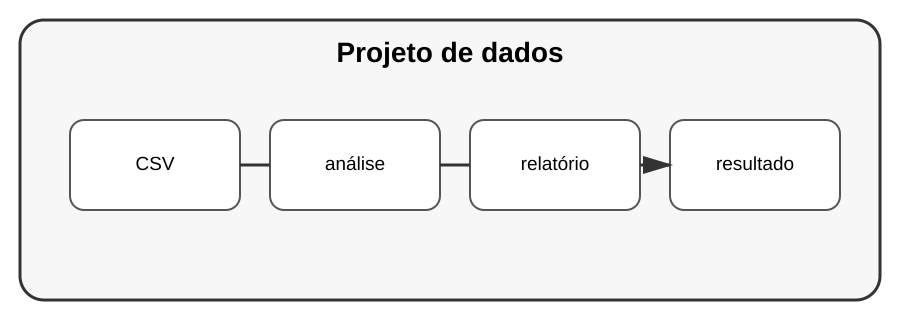

# Aula 8 — Projeto: análise de dados e automação

**Assinatura:** Domingos Ferraz Fonseca

## Projeto

Vamos construir um sistema que recebe dados, analisa-os e gera um relatório.

## Fluxo

~~~text
CSV
 ↓
validação
 ↓
pandas
 ↓
análise
 ↓
gráficos
 ↓
relatório
~~~

## Funcionalidades

- carregar CSV;
- validar colunas;
- tratar dados inválidos;
- calcular indicadores;
- gerar gráficos;
- guardar resultados;
- registar operações.

## Estrutura sugerida

~~~text
analise_vendas/
├── app/
│   ├── carregar.py
│   ├── validar.py
│   ├── analisar.py
│   └── relatorio.py
├── dados/
├── testes/
└── README.md
~~~

## Desafio final

Adicione uma etapa opcional de IA que produza uma explicação textual dos indicadores, sem substituir os cálculos verificáveis do programa.

## Checklist

- [ ] dados carregados
- [ ] validação
- [ ] análise
- [ ] gráficos
- [ ] testes
- [ ] logging
- [ ] documentação
- [ ] tratamento de erros

## Revisão do Volume 14

Agora Python também foi aplicado a dados, automação, visualização, web scraping e IA.

O princípio central continua o mesmo: compreender o problema, escolher ferramentas adequadas e construir soluções verificáveis e seguras.
