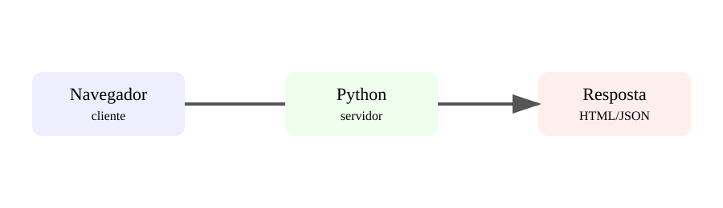

# Aula 1 — Python na Web

**Assinatura:** Domingos Ferraz Fonseca

## O que vamos aprender

Até aqui aprendemos Python, dados, APIs, testes, arquitetura, automação e IA. Agora vamos colocar Python dentro do mundo da Web.

Uma aplicação Web é um programa que recebe pedidos, executa regras e devolve respostas. O navegador é um cliente. O servidor é o computador que executa a aplicação.

### Uma ideia simples

Quando visitas uma página:

1. o navegador envia um pedido;
2. o servidor recebe o pedido;
3. Python executa o código necessário;
4. o servidor prepara uma resposta;
5. o navegador mostra o resultado.

## HTTP em linguagem simples

HTTP é um protocolo usado para trocar mensagens na Web.

Alguns métodos importantes:

- **GET**: pedir informação;
- **POST**: enviar informação para criar algo;
- **PUT/PATCH**: alterar informação;
- **DELETE**: remover informação.

Exemplo de uma função Python que poderia representar uma regra de negócio:

~~~python
def saudacao(nome):
    return f"Olá, {nome}!"
~~~

A aplicação Web usa funções como esta e as liga a rotas.

## Exercício guiado

Cria uma função chamada `mensagem` que receba um nome e devolva uma frase de boas-vindas.

## Exercícios

1. Explica com as tuas palavras o que é um servidor.
2. Diz quando usarias GET e POST.
3. Cria uma função que receba idade e devolva uma mensagem.
4. Desenha no papel o caminho navegador → servidor → resposta.

## Desafio

Imagina uma página de lista de tarefas. Define três rotas que essa aplicação poderia ter.

## Boas práticas

- Separa a apresentação das regras de negócio.
- Não coloques palavras-passe diretamente no código.
- Valida dados recebidos do utilizador.
- Mantém cada função com uma responsabilidade clara.

## Revisão

**Cliente pede → servidor processa → aplicação responde.**

A Web é uma nova forma de usar os conhecimentos de Python que já construímos.
