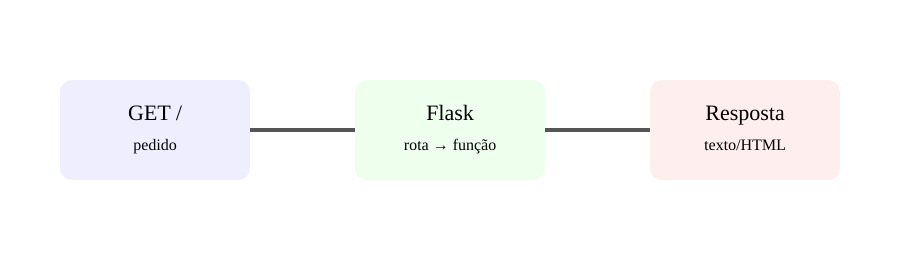

# Aula 2 — Primeiros passos com Flask

**Assinatura:** Domingos Ferraz Fonseca

## O que é Flask?

Flask é um microframework Web para Python. Ele fornece ferramentas para criar aplicações HTTP sem obrigar o projeto a seguir uma estrutura gigante.

Instalação:

~~~bash
pip install flask
~~~

Exemplo mínimo:

~~~python
from flask import Flask

app = Flask(__name__)

@app.get("/")
def inicio():
    return "Olá, Web!"

if __name__ == "__main__":
    app.run(debug=True)
~~~

A expressão `@app.get("/")` diz que a função será executada quando alguém fizer um GET para a rota `/`.

## Rotas

Podemos criar outras rotas:

~~~python
@app.get("/sobre")
def sobre():
    return "Esta é a página Sobre."
~~~

Uma rota é como uma porta de entrada da aplicação.

## Exercício guiado

Cria uma aplicação com três rotas:

- `/`
- `/sobre`
- `/contato`

Cada uma deve devolver uma mensagem diferente.

## Exercícios

1. Para que serve `Flask(__name__)`?
2. O que significa GET?
3. Cria uma rota `/ola`.
4. Cria uma rota `/numero` que devolva um número.

## Desafio

Cria uma pequena aplicação chamada "Minha Escola" com rotas para início, alunos e disciplinas.

## Boas práticas

Use `debug=True` apenas durante o desenvolvimento. Em produção, use uma configuração apropriada e um servidor adequado.

## Revisão

Flask transforma funções Python em pontos de entrada HTTP.
