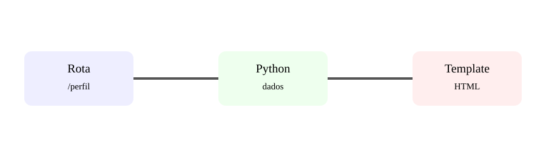

# Aula 3 — Rotas e templates HTML

**Assinatura:** Domingos Ferraz Fonseca

## Do texto para páginas

Uma aplicação Web normalmente precisa devolver HTML. Em vez de construir HTML inteiro dentro de strings Python, podemos usar templates.

Estrutura comum:

~~~text
projeto/
├── app.py
└── templates/
    └── inicio.html
~~~

Python:

~~~python
from flask import Flask, render_template

app = Flask(__name__)

@app.get("/")
def inicio():
    return render_template("inicio.html")
~~~

Template:

~~~html
<!doctype html>
<html>
  <body>
    <h1>Olá!</h1>
    
Minha primeira página Python.

  </body>
</html>
~~~

## Passando dados

~~~python
@app.get("/aluno")
def aluno():
    return render_template("aluno.html", nome="Ana")
~~~

No template:

~~~html
<h1>Olá, {{ nome }}!</h1>
~~~

## Exercício guiado

Cria uma página que receba o nome de uma pessoa através de uma variável Python e mostre uma saudação.

## Exercícios

1. Cria um template com título e parágrafo.
2. Passa duas variáveis para um template.
3. Cria uma página com uma lista.
4. Explica a vantagem de separar HTML e Python.

## Desafio

Cria uma página de perfil que receba nome, profissão e cidade.

## Boas práticas

Organiza os templates em pastas quando a aplicação crescer. Mantém regras de negócio fora do HTML.

## Revisão

**Rota → função → dados → template → HTML.**
