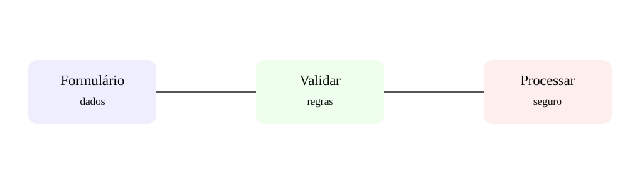

# Aula 4 — Formulários e validação

**Assinatura:** Domingos Ferraz Fonseca

## Formulários

Formulários permitem que uma pessoa envie dados para a aplicação.

Exemplo HTML:

~~~html
<form method="post">
  <input name="nome">
  <button type="submit">Enviar</button>
</form>
~~~

Em Flask:

~~~python
from flask import Flask, request

app = Flask(__name__)

@app.post("/cadastro")
def cadastro():
    nome = request.form.get("nome", "").strip()

    if not nome:
        return "Nome obrigatório", 400

    return f"Cadastro recebido para {nome}."
~~~

## Por que validar?

O utilizador pode enviar:

- campo vazio;
- texto onde esperávamos número;
- valor demasiado grande;
- dados com formato inválido.

A validação protege a aplicação e melhora a experiência.

## Exercício guiado

Cria um formulário que peça nome e idade. Verifica se ambos foram preenchidos.

## Exercícios

1. Valida um campo de email de forma básica.
2. Verifica se a idade pode ser convertida para inteiro.
3. Devolve status HTTP 400 quando os dados forem inválidos.
4. Explica por que validar no servidor é importante.

## Desafio

Cria um cadastro de aluno com nome, idade e curso.

## Boas práticas

Nunca confies nos dados enviados pelo navegador. A validação no servidor é obrigatória para dados importantes.

## Revisão

**Receber → validar → transformar → processar → responder.**
