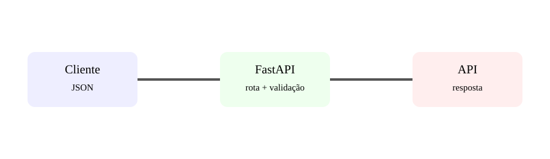

# Aula 5 — APIs modernas com FastAPI

**Assinatura:** Domingos Ferraz Fonseca

## O que é FastAPI?

FastAPI é um framework Python focado na criação de APIs. Ele aproveita type hints para validação, documentação e clareza.

Exemplo:

~~~python
from fastapi import FastAPI

app = FastAPI()

@app.get("/saudacao")
def saudacao(nome: str = "mundo"):
    return {"mensagem": f"Olá, {nome}!"}
~~~

A resposta é JSON.

## Modelos de dados

Podemos usar Pydantic através dos recursos integrados do FastAPI:

~~~python
from pydantic import BaseModel

class Produto(BaseModel):
    nome: str
    preco: float
~~~

Depois podemos receber um produto:

~~~python
@app.post("/produtos")
def criar_produto(produto: Produto):
    return produto
~~~

## Exercício guiado

Cria um modelo `Aluno` com nome e idade. Cria uma rota POST que receba esse modelo.

## Exercícios

1. Cria uma rota GET.
2. Cria um modelo com três campos.
3. Explica a diferença entre uma página HTML e uma API JSON.
4. Adiciona um campo obrigatório.

## Desafio

Cria uma mini API de livros com rotas para listar e criar livros.

## Boas práticas

Use type hints, modelos explícitos, respostas consistentes e validação automática. Documenta as rotas importantes.

## Revisão

FastAPI é especialmente útil quando queremos construir APIs claras, tipadas e fáceis de documentar.
