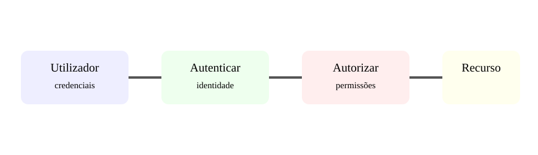

# Aula 6 — Autenticação e autorização na Web

**Assinatura:** Domingos Ferraz Fonseca

## Duas palavras importantes

**Autenticação** responde: "Quem és tu?"

**Autorização** responde: "O que tens permissão para fazer?"

Exemplo conceitual:

~~~text
Pessoa → login → identidade confirmada → permissões → recurso
~~~

## Palavras-passe

Nunca guardes palavras-passe em texto puro.

Em aplicações reais, usa bibliotecas e algoritmos de hashing apropriados, como os fornecidos por soluções maduras do ecossistema Python.

A ideia é:

~~~text
palavra-passe → hash → armazenamento
~~~

Na entrada:

~~~text
palavra-passe → verificação contra hash
~~~

## Sessões e tokens

Uma aplicação pode manter uma sessão no servidor ou usar tokens para APIs. Cada escolha tem consequências de segurança e arquitetura.

## Exercício guiado

Desenha o fluxo de login de uma aplicação escolar:

1. utilizador envia credenciais;
2. servidor valida;
3. aplicação identifica o utilizador;
4. acesso é concedido ou recusado.

## Exercícios

1. Define autenticação.
2. Define autorização.
3. Explica por que não devemos guardar palavras-passe em texto puro.
4. Dá dois exemplos de permissões.

## Desafio

Cria uma tabela de permissões para administrador, professor e aluno.

## Boas práticas

- Usa hashing apropriado.
- Usa HTTPS em produção.
- Dá apenas as permissões necessárias.
- Expira sessões e tokens de acordo com o risco.
- Não coloques segredos no código-fonte.

## Revisão

Identidade e permissão são problemas diferentes. Uma aplicação segura trata ambos explicitamente.
