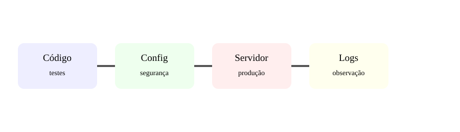

# Aula 7 — Colocar uma aplicação no ar

**Assinatura:** Domingos Ferraz Fonseca

## Desenvolvimento e produção

No computador do programador podemos usar ferramentas de desenvolvimento. Em produção, precisamos de uma configuração preparada para utilizadores reais.

Fluxo simplificado:

~~~text
Código → testes → build/configuração → servidor → utilizadores
~~~

## Checklist

Antes de publicar:

- executar testes;
- verificar configurações;
- retirar segredos do código;
- ativar HTTPS;
- configurar logs;
- preparar banco de dados;
- limitar permissões;
- definir como atualizar e voltar atrás.

## Variáveis de ambiente

Em vez de:

~~~python
CHAVE = "segredo-aqui"
~~~

prefere configuração externa:

~~~python
import os

CHAVE = os.getenv("CHAVE_API")
~~~

Assim, o código não precisa conter o segredo.

## Exercício guiado

Cria uma lista de verificação com 10 itens para publicar uma aplicação Web.

## Exercícios

1. Explica a diferença entre desenvolvimento e produção.
2. Por que usar variáveis de ambiente?
3. Para que serve HTTPS?
4. Por que logs são importantes?

## Desafio

Desenha uma arquitetura simples com utilizador, domínio, servidor Web, aplicação Python e banco de dados.

## Boas práticas

Publicar não é apenas "copiar arquivos". É preparar segurança, configuração, observabilidade, dados e recuperação de falhas.

## Revisão

**Testar → configurar → proteger → publicar → observar → melhorar.**
