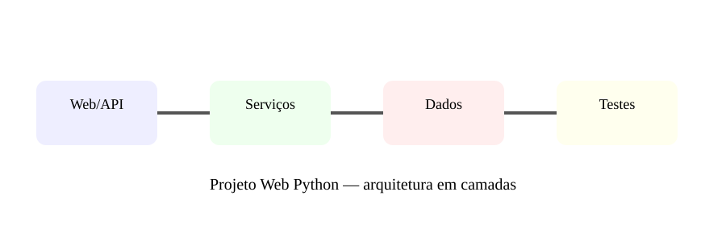

# Aula 8 — Projeto final: sistema Web completo

**Assinatura:** Domingos Ferraz Fonseca

## O projeto

Vamos juntar os conhecimentos do volume para imaginar uma aplicação Web de tarefas.

Funcionalidades:

- criar conta;
- entrar;
- criar tarefa;
- listar tarefas;
- editar tarefa;
- concluir tarefa;
- eliminar tarefa;
- API para consultar tarefas;
- validação;
- logs;
- testes.

## Arquitetura sugerida

~~~text
Navegador
   ↓
Rotas Web/API
   ↓
Serviços
   ↓
Repositórios
   ↓
Banco de dados
~~~

A interface não deve conhecer todos os detalhes do banco de dados. Os serviços concentram regras de negócio.

## Etapa 1 — Planeamento

Define:

- utilizadores;
- tarefas;
- estados;
- permissões;
- rotas;
- dados necessários.

## Etapa 2 — Modelo

Uma tarefa pode ter:

~~~python
class Tarefa:
    def __init__(self, titulo, concluida=False):
        self.titulo = titulo
        self.concluida = concluida
~~~

Num projeto real, o modelo pode ser uma dataclass, modelo ORM ou estrutura equivalente.

## Etapa 3 — API

Exemplos de endpoints:

~~~text
GET    /tarefas
POST   /tarefas
GET    /tarefas/{id}
PATCH  /tarefas/{id}
DELETE /tarefas/{id}
~~~

## Etapa 4 — Qualidade

Cria testes para:

- criação;
- validação;
- autenticação;
- permissões;
- atualização;
- eliminação;
- erros esperados.

## Exercício guiado

Começa apenas com listar e criar tarefas. Depois adiciona uma funcionalidade por vez.

## Exercícios

1. Desenha a arquitetura.
2. Define cinco endpoints.
3. Define três regras de autorização.
4. Escreve casos de teste.
5. Cria uma lista de riscos de segurança.

## Grande desafio

Transforma o projeto numa aplicação que possa ser demonstrada como portefólio. Inclui README, testes, configuração, logs, documentação da API e instruções claras para executar localmente.

## Boas práticas profissionais

- Faz commits pequenos e claros.
- Não guarda segredos no Git.
- Valida entradas.
- Testa regras importantes.
- Regista erros sem expor dados sensíveis.
- Mantém dependências atualizadas.
- Documenta decisões arquiteturais.

## Revisão final do volume

Neste volume aprendemos a levar Python para a Web: HTTP, Flask, templates, formulários, FastAPI, autenticação, deploy e arquitetura de um projeto completo.

**Próximo passo:** continuar para especializações ainda mais profundas, como machine learning, sistemas distribuídos, mensageria e engenharia de plataformas.
