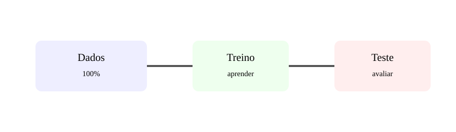

# Aula 2 — Dados, treino e teste

**Assinatura:** Domingos Ferraz Fonseca

## Por que separar os dados?

Se treinarmos e avaliarmos com os mesmos exemplos, podemos obter uma impressão enganadora de qualidade.

Uma divisão simples é: dados → treino + teste. O treino ajuda o modelo a aprender; o teste verifica o comportamento em dados que não viu durante o treino.

### Features e target

Imagine uma tabela com horas_estudo, faltas e nota. As **features** são horas_estudo e faltas. O **target** é nota.

Exemplo:

    from sklearn.model_selection import train_test_split

    X_train, X_test, y_train, y_test = train_test_split(
        X, y, test_size=0.2, random_state=42
    )

## Exercício guiado

Cria uma tabela imaginária com 10 exemplos e identifica features e target.

## Exercícios

1. Explica o conjunto de treino.
2. Explica o conjunto de teste.
3. O que são features?
4. O que é target?

## Desafio

Explica por que avaliar um modelo apenas nos dados que ele memorizou pode ser enganador.

## Boas práticas

Não deixes informação do teste influenciar o treino. Essa contaminação indevida é conhecida como data leakage.

## Revisão

**Treinar com uma parte; avaliar com dados separados.**