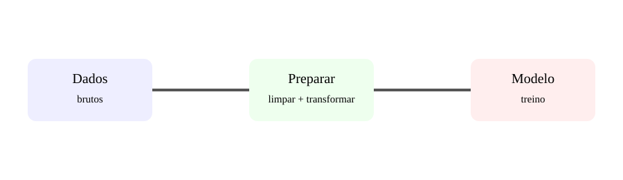

# Aula 3 — Pré-processamento de dados

**Assinatura:** Domingos Ferraz Fonseca

Dados reais podem conter valores ausentes, texto, escalas diferentes, categorias e inconsistências. Antes do treino, precisamos preparar os dados.

### Escalonamento

Uma variável pode variar entre 0 e 100 e outra entre 0 e 100000. Alguns algoritmos beneficiam de escalonamento.

### Categorias

Valores como Luanda, Benguela e Huambo precisam de transformação adequada antes de muitos modelos.

### Pipeline

    from sklearn.pipeline import Pipeline

    pipeline = Pipeline([
        ("preparacao", transformador),
        ("modelo", modelo),
    ])

Pipelines ajudam a manter o processo reproduzível.

## Exercício guiado

Lista cinco problemas que podem existir numa tabela antes do treino.

## Exercícios

1. O que é pré-processamento?
2. Por que tratar valores ausentes?
3. O que é escalonamento?
4. Por que pipelines ajudam?

## Desafio

Desenha: dados → limpeza → transformação → modelo → previsão.

## Boas práticas

As transformações devem ser aprendidas usando dados apropriados do treino. Pipelines ajudam a evitar erros.

## Revisão

**Dados preparados → processo mais confiável.**