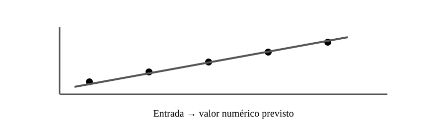

# Aula 4 — Regressão

**Assinatura:** Domingos Ferraz Fonseca

Regressão é usada quando queremos prever um valor numérico: preço, temperatura, consumo ou tempo estimado.

### Regressão linear

    from sklearn.linear_model import LinearRegression

    modelo = LinearRegression()
    modelo.fit(X_train, y_train)
    previsoes = modelo.predict(X_test)

Uma previsão pode diferir do valor real. Uma métrica comum é o MAE.

    from sklearn.metrics import mean_absolute_error
    erro = mean_absolute_error(y_test, previsoes)

Quanto menor o MAE, melhor, desde que a comparação seja feita no mesmo problema e conjunto de dados.

## Exercício guiado

Cria uma tabela com horas estudadas e uma nota estimada. Identifica entrada e saída.

## Exercícios

1. Define regressão.
2. Dá três exemplos.
3. Para que serve MAE?
4. O que significa uma previsão errada?

## Desafio

Compara dois modelos usando uma métrica adequada.

## Boas práticas

Não escolhas um modelo apenas porque produziu um número. Avalia-o de forma apropriada.

## Revisão

**Regressão → prever números.**