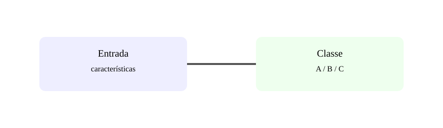

# Aula 5 — Classificação

**Assinatura:** Domingos Ferraz Fonseca

Classificação é usada quando queremos escolher uma categoria: spam/não spam, aprovado/não aprovado ou classe A/B/C.

Exemplo com regressão logística:

    from sklearn.linear_model import LogisticRegression

    modelo = LogisticRegression()
    modelo.fit(X_train, y_train)
    previsoes = modelo.predict(X_test)

A matriz de confusão ajuda a observar acertos e erros por classe.

## Exercício guiado

Cria um exemplo com duas classes e cinco previsões, indicando quais estão corretas.

## Exercícios

1. Define classificação.
2. Dá dois exemplos binários.
3. O que é matriz de confusão?
4. Por que a quantidade total de acertos pode não ser suficiente?

## Desafio

Imagina um classificador de três tipos de fruta e define classes e features.

## Boas práticas

Escolhe métricas de acordo com o custo dos erros. Falso positivo e falso negativo podem ter impactos diferentes.

## Revisão

**Classificação → prever categorias.**