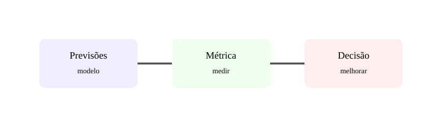

# Aula 6 — Métricas e avaliação de modelos

**Assinatura:** Domingos Ferraz Fonseca

Um modelo precisa ser avaliado de forma objetiva.

Para classificação, métricas importantes incluem **accuracy**, **precision**, **recall** e **F1**.

- accuracy: proporção de previsões corretas;
- precision: entre os positivos previstos, quantos eram positivos;
- recall: entre os positivos reais, quantos foram encontrados;
- F1: equilíbrio entre precision e recall.

Exemplo:

    from sklearn.metrics import accuracy_score
    accuracy = accuracy_score(y_test, previsoes)

### Validação cruzada

    from sklearn.model_selection import cross_val_score
    scores = cross_val_score(modelo, X, y, cv=5)

A validação cruzada repete treino e avaliação em diferentes divisões.

## Exercício guiado

Explica por que accuracy pode ser inadequada quando as classes são muito desequilibradas.

## Exercícios

1. Define precision.
2. Define recall.
3. Define F1.
4. O que é validação cruzada?

## Desafio

Escolhe métricas para um classificador de spam e justifica.

## Boas práticas

A métrica deve acompanhar o objetivo real do problema.

## Revisão

**Medir o desempenho transforma resultados em informação.**