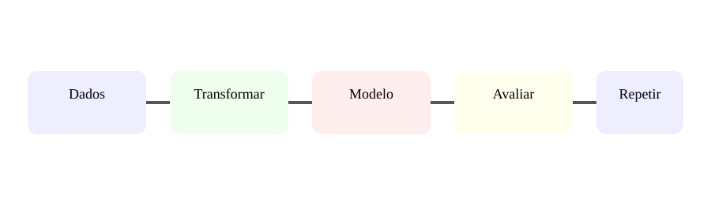

# Aula 7 — Pipelines e comparação de modelos

**Assinatura:** Domingos Ferraz Fonseca

Um projeto de ML pode ter várias etapas: dados → limpeza → transformação → modelo → avaliação.

Exemplo:

    from sklearn.pipeline import Pipeline
    from sklearn.preprocessing import StandardScaler
    from sklearn.linear_model import LogisticRegression

    pipeline = Pipeline([
        ("escala", StandardScaler()),
        ("modelo", LogisticRegression()),
    ])

    pipeline.fit(X_train, y_train)
    previsoes = pipeline.predict(X_test)

Podemos comparar modelos usando a mesma estratégia de validação. Além do score, considera velocidade, complexidade, interpretabilidade e custo.

## Exercício guiado

Desenha duas pipelines e escolhe uma métrica comum.

## Exercícios

1. O que é uma pipeline?
2. Por que repetir o mesmo pré-processamento é importante?
3. Indica três critérios de comparação.
4. Por que o maior score nem sempre significa a melhor solução?

## Desafio

Cria um plano de experiência com hipótese, dados, modelos, métrica e conclusão.

## Boas práticas

Regista experiências e versões relevantes dos dados e código. Evita escolher com base num único teste.

## Revisão

**Experimentar de forma organizada é parte do trabalho de ML.**