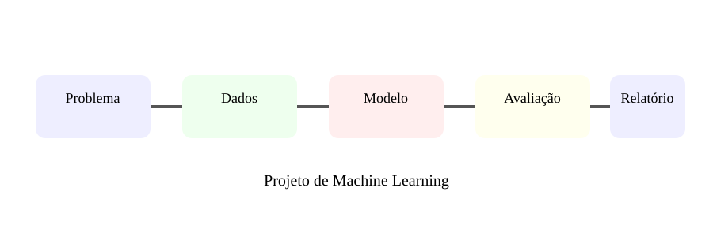

# Aula 8 — Projeto final de Machine Learning

**Assinatura:** Domingos Ferraz Fonseca

Vamos construir o plano de um projeto completo de ML.

### Etapa 1 — Definir o problema

Escreve o que queremos prever, para quem a previsão será útil, quais são as entradas, qual será a métrica e quais são as limitações.

### Etapa 2 — Conhecer os dados

Verifica tamanho, tipos, valores ausentes, distribuição, classes, erros e possíveis data leakage.

### Etapa 3 — Criar baseline

Antes de procurar um modelo sofisticado, cria uma referência simples. Assim sabemos se o modelo acrescenta valor.

### Etapa 4 — Treinar

Prepara os dados, separa treino/teste e constrói uma pipeline.

### Etapa 5 — Avaliar

Usa métricas adequadas e analisa exemplos de erro.

### Etapa 6 — Documentar

Explica problema, dados, metodologia, resultados, limitações e como executar.

## Exercício guiado

Cria um mini projeto com um conjunto de dados pequeno. Faz a separação treino/teste e define a métrica antes do treino.

## Exercícios

1. Escreve o objetivo.
2. Define features e target.
3. Escolhe uma métrica.
4. Lista riscos de leakage.
5. Cria um baseline.

## Grande desafio

Cria um repositório com código organizado, README, ambiente reproduzível, pipeline, avaliação e relatório.

## Boas práticas

Um modelo não é verdade absoluta. Dados mudam, desempenho pode degradar e previsões podem ter consequências. Documenta limites e usa revisão humana quando necessário.

## Revisão final

Aprendemos problema, dados, treino, teste, pré-processamento, regressão, classificação, métricas, pipelines e projeto completo.

**Próximo passo:** aprofundar modelos, séries temporais, redes neuronais e MLOps.