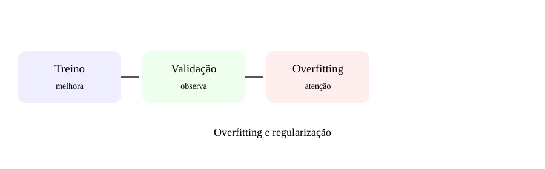

# Aula 5 — Overfitting e regularização

**Assinatura:** Domingos Ferraz Fonseca

## O que vamos aprender

Overfitting acontece quando o modelo aprende demasiado os dados de treino e generaliza pior. Estratégias incluem dropout, regularização e early stopping.

## Ideia principal

Treino melhora → validação piora → investigar.

Esta é uma visão simplificada. Em projetos reais, existem mais detalhes, escolhas de arquitetura, dados e métricas.

## Exemplo

Uma experiência de deep learning normalmente segue esta sequência:

    dados → preparação → modelo → treino → avaliação

O objetivo não é decorar nomes. Primeiro entende o caminho dos dados.

## Exercício guiado

Desenha curvas de treino e validação e marca o possível overfitting.

## Exercícios

1. Explica o conceito com as tuas palavras.
2. Dá um exemplo de utilização.
3. Indica uma dificuldade que pode aparecer.
4. Desenha o fluxo no papel.

## Desafio

Cria uma pequena experiência relacionada com o tema da aula e escreve o que esperas observar.

## Boas práticas

- Separa treino, validação e teste.
- Regista experiências e configurações.
- Avalia modelos com métricas adequadas.
- Não assumes que uma previsão está correta só porque foi produzida por um modelo.
- Documenta limitações e possíveis fontes de erro.

## Revisão

Treino melhora → validação piora → investigar.

O próximo passo é ligar estes conceitos a projetos maiores e a sistemas de IA em produção.
