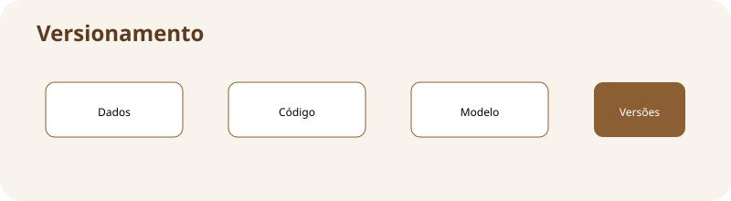

# Versionamento de dados e modelos

**Assinatura:** Domingos Ferraz Fonseca

## O que vamos aprender

Um modelo depende dos dados e do código que o criou. Versionar estes elementos ajuda a repetir resultados e descobrir mudanças.

**Mapa da aula:** dados + código + modelo → versões identificáveis

## Ideia principal

Um modelo não vive sozinho. Ele depende dos dados de treino, do código, das configurações e das bibliotecas. Se alterarmos qualquer peça sem registar a mudança, pode ser difícil explicar por que o resultado mudou.

Por isso usamos identificadores de versão e guardamos metadados do experimento.

## Exemplo em Python

~~~python
experimento = {
    "codigo": "v3",
    "dados": "dataset-v2",
    "modelo": "modelo-v5"
}
print(experimento)
~~~

O exemplo é pequeno de propósito. Em sistemas reais, cada etapa pode ser implementada por várias ferramentas, mas a ideia fundamental continua a mesma: **controlar o ciclo de vida do modelo**.

## Exercício guiado

1. Leia o exemplo.
2. Identifique a entrada e a saída.
3. Altere pelo menos um valor.
4. Execute novamente.
5. Explique com as suas palavras o que mudou.

**Tarefa:** Crie um dicionário com versões do seu projeto.

## Exercícios

1. Explique por que um modelo em produção precisa de acompanhamento.
2. Dê um exemplo de informação que deve ser versionada.
3. Imagine um problema que poderia acontecer sem validação.
4. Desenhe uma pequena pipeline com pelo menos quatro etapas.

## Desafio

Crie no papel ou em Python uma pequena pipeline com **dados → treino → validação → produção → monitorização**. Depois escreva uma frase explicando a responsabilidade de cada etapa.

## Boas práticas

- Registe versões de código, dados e modelos.
- Automatize verificações repetitivas.
- Não coloque segredos diretamente no código.
- Registe métricas importantes.
- Tenha uma forma clara de voltar a uma versão anterior.
- Documente decisões técnicas.

## Revisão

MLOps trata do ciclo de vida do Machine Learning. O modelo precisa ser treinado, validado, disponibilizado e acompanhado. Quanto mais claro for esse processo, mais fácil será manter o sistema confiável.

**Pergunta final:** se o modelo piorar amanhã, você conseguiria descobrir **qual modelo estava em produção, com quais dados foi treinado e qual código o criou**?