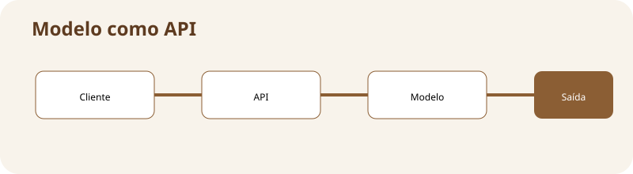

# Deploy de modelo como API

**Assinatura:** Domingos Ferraz Fonseca

## O que vamos aprender

Uma API permite que outros programas enviem dados para um modelo e recebam previsões.

**Mapa da aula:** cliente → HTTP → API → modelo → previsão

## Ideia principal

Uma forma prática de disponibilizar um modelo é colocá-lo atrás de uma API. O cliente envia uma entrada e a aplicação devolve uma previsão.

A API deve validar os dados recebidos, tratar erros e controlar o acesso conforme a necessidade do sistema.

## Exemplo em Python

~~~python
def prever(valor):
    return {"entrada": valor, "previsao": 1}

print(prever(42))
~~~

O exemplo é pequeno de propósito. Em sistemas reais, cada etapa pode ser implementada por várias ferramentas, mas a ideia fundamental continua a mesma: **controlar o ciclo de vida do modelo**.

## Exercício guiado

1. Leia o exemplo.
2. Identifique a entrada e a saída.
3. Altere pelo menos um valor.
4. Execute novamente.
5. Explique com as suas palavras o que mudou.

**Tarefa:** Escreva uma função que receba uma entrada e devolva uma previsão fictícia.

## Exercícios

1. Explique por que um modelo em produção precisa de acompanhamento.
2. Dê um exemplo de informação que deve ser versionada.
3. Imagine um problema que poderia acontecer sem validação.
4. Desenhe uma pequena pipeline com pelo menos quatro etapas.

## Desafio

Crie no papel ou em Python uma pequena pipeline com **dados → treino → validação → produção → monitorização**. Depois escreva uma frase explicando a responsabilidade de cada etapa.

## Boas práticas

- Registe versões de código, dados e modelos.
- Automatize verificações repetitivas.
- Não coloque segredos diretamente no código.
- Registe métricas importantes.
- Tenha uma forma clara de voltar a uma versão anterior.
- Documente decisões técnicas.

## Revisão

MLOps trata do ciclo de vida do Machine Learning. O modelo precisa ser treinado, validado, disponibilizado e acompanhado. Quanto mais claro for esse processo, mais fácil será manter o sistema confiável.

**Pergunta final:** se o modelo piorar amanhã, você conseguiria descobrir **qual modelo estava em produção, com quais dados foi treinado e qual código o criou**?