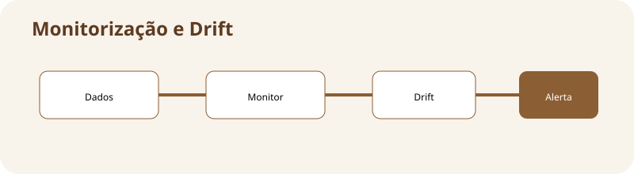

# Monitorização e drift

**Assinatura:** Domingos Ferraz Fonseca

## O que vamos aprender

Depois do deploy, precisamos observar erros, latência e mudanças nos dados. Drift pode indicar que o mundo mudou.

**Mapa da aula:** dados antigos ≠ dados atuais → alerta → investigação

## Ideia principal

Um modelo pode começar a receber dados diferentes daqueles usados no treino. Essa mudança é chamada drift. Também devemos observar métricas técnicas, como tempo de resposta e número de erros.

Monitorização não serve apenas para criar gráficos. Ela ajuda a decidir quando investigar e quando treinar novamente.

## Exemplo em Python

~~~python
drift = 0.18
limite = 0.10
if drift > limite:
    print("Investigar possível drift")
~~~

O exemplo é pequeno de propósito. Em sistemas reais, cada etapa pode ser implementada por várias ferramentas, mas a ideia fundamental continua a mesma: **controlar o ciclo de vida do modelo**.

## Exercício guiado

1. Leia o exemplo.
2. Identifique a entrada e a saída.
3. Altere pelo menos um valor.
4. Execute novamente.
5. Explique com as suas palavras o que mudou.

**Tarefa:** Defina um limite de drift e faça um alerta simples.

## Exercícios

1. Explique por que um modelo em produção precisa de acompanhamento.
2. Dê um exemplo de informação que deve ser versionada.
3. Imagine um problema que poderia acontecer sem validação.
4. Desenhe uma pequena pipeline com pelo menos quatro etapas.

## Desafio

Crie no papel ou em Python uma pequena pipeline com **dados → treino → validação → produção → monitorização**. Depois escreva uma frase explicando a responsabilidade de cada etapa.

## Boas práticas

- Registe versões de código, dados e modelos.
- Automatize verificações repetitivas.
- Não coloque segredos diretamente no código.
- Registe métricas importantes.
- Tenha uma forma clara de voltar a uma versão anterior.
- Documente decisões técnicas.

## Revisão

MLOps trata do ciclo de vida do Machine Learning. O modelo precisa ser treinado, validado, disponibilizado e acompanhado. Quanto mais claro for esse processo, mais fácil será manter o sistema confiável.

**Pergunta final:** se o modelo piorar amanhã, você conseguiria descobrir **qual modelo estava em produção, com quais dados foi treinado e qual código o criou**?